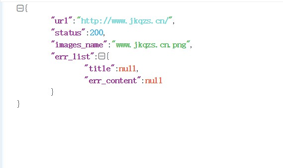
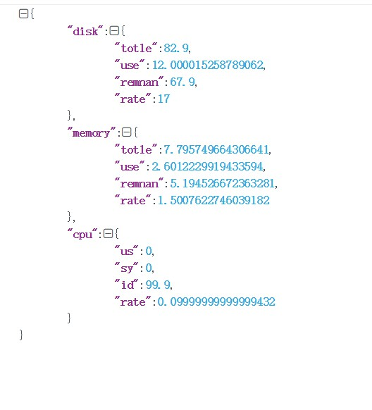

# Keeper项目文档
### 一、环境搭建:
- Python环境搭建
    - Python3.6   
    ```cmd 
     pip install -r requirements.txt安装第三方库
    ```
- 被监控服务安装软件
    - Linux 
        - SSH(确保SSH能正常连接服务器)
    - Windows
        - Windows[软件下载地址](https://github.com/PowerShell/Win32-OpenSSH/releases)
        - Windows安装命令
            - 解压软件后进行目录执行如下命令：
            - 1.安装Open SSH
            ```cmd
            powershell.exe -ExecutionPolicy Bypass -File install-sshd.ps1
            ```
            - 2.打开防火墙
            ```cmd
            New-NetFirewallRule -Name sshd -DisplayName 'OpenSSH Server (sshd)' -Enabled True -Direction Inbound -Protocol TCP -Action Allow -LocalPort 22
            ```
            - 此命令是windows 2012（含）以上的服务器使用，如果较低版本server
            ```cmd
            netsh advfirewall firewall add rule name=sshd dir=in action=allow protocol=TCP localport=22
            ```
            - 启动服务
            ```cmd
            net start sshd
            ```
            *建议Win下设置系统开启后自动重启*
### 二、PHP调用Web监控脚本规则
- 使用规则
    - 调用脚本文件
        - get_web.py
    - 调用规则
        - 需要传入URL（确保能正常打开）
    - 返回参数
    ```json
    {"url": "http://www.jkqzs.cn/", "status": 200, "images_name": "www.jkqzs.cn.png", "err_list": {"title": null, "err_content": null}}
    ```
  
- 注意事项：
    - 1.图片是根据是URL连接拼接而成。
    - 2.爬虫效率问题。
        - 1.受本地网络、服务器反应时间、以及页面加载时间的影响。
        - 2.URL不存在
        - 3.请求超时

### 三、PHP调用服务器监控脚本文件
- 使用规则
    - 脚本调用
        - 1.Linux
            - lin_servicer.py
            ```json
            {"disk": {"\u78c1\u76d8\u5927\u5c0f": 51.6123046875, "\u4f7f\u7528\u5927\u5c0f": 39.6064453125, "\u672a\u7528\u5927\u5c0f": 9.30578842163086, "\u4f7f\u7528\u7387": 28}, "memory": {"\u5185\u5b58\u603b\u91cf": 0.96240234375, "\u4f7f\u7528\u5185\u5b58": 0.5219879150390625, "\u7a7a\u95f2\u5185\u5b58": 0.18045806884765625, "\u4f7f\u7528\u7387": 5.3331078510125565}, "cpu": {"\u7528\u6237\u5360\u7528": 0.7, "\u5185\u6838\u5360\u7528": 0.5, "\u7a7a\u95f2\u7a7a\u95f4": 98.5, "\u4f7f\u7528\u7387": 1.5}}      
            ```
            
        - 2.Windows
            - win_servicer.py
            ```json
            {"cpu": {"total": 4, "percent": 0.0}, "disk": {"total": 79.46191024780273, "use": 17.30633544921875, "residue": 62.155574798583984, "percent": 0.21779410280030742}, "memory": {"total": 7.999134063720703, "use": 1.6353759765625, "residue": 6.363758087158203, "percent": 20.4}}          
            ```
            
    - 所需参数
        服务器（ip、username、password）
    - 注意事项（被监控的服务环境）
        - Linux    
            - 在调用脚本是确保SSH能够正常连接到服务器
        - Windows
            - 安装Open SSH(环境搭建 Windows)
            - 安装Python3.6
            - 安装Python第三方库
            ```cmd
            pip install pandas==1.0.0
            ```
            ```cmd
            pip install psutil==5.6.7
            ```

    
   

